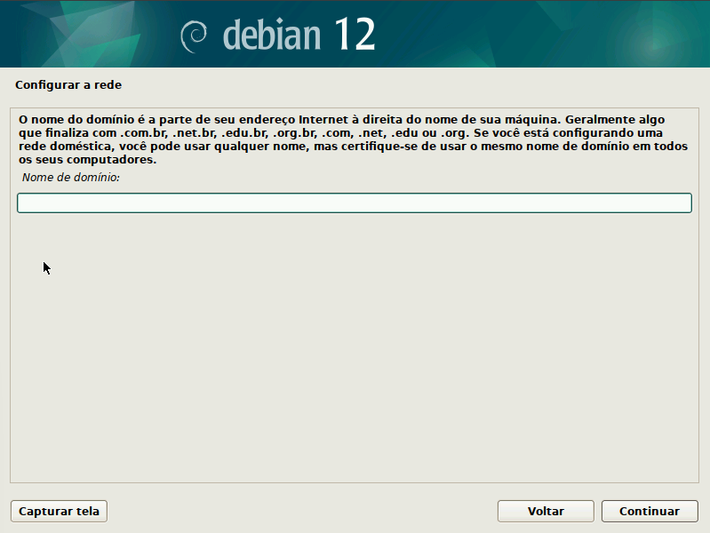
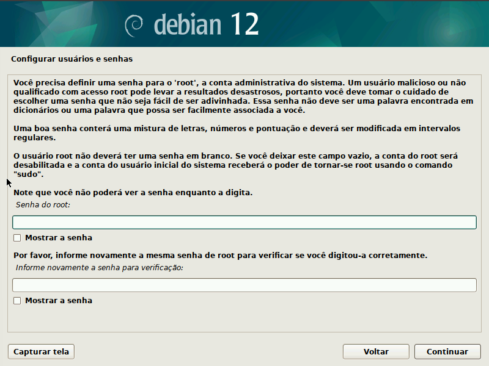
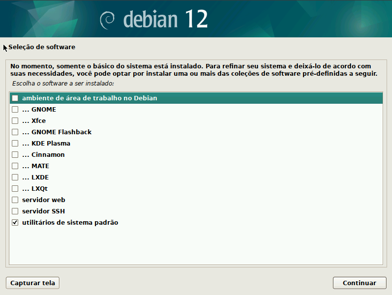

# Configuring a new debian machine the right way

## Introduction 

This article serves as a personal guide, ensuring that I always have an accessible reference for configuring a new Debian machine with i3 gaps. This approach stands in contrast to the default graphical environments that Debian offers during its graphical installation process

In this guide, I am focusing on the latest Debian release up to today, which is Debian 12. However, depending on the timing of your reading, a new version might have become available, rendering this guide potentially unsuitable for your configuration needs.

## Graphical Installation

You can get the Debian 12 [iso](https://cdimage.debian.org/debian-cd/current/amd64/iso-cd/debian-12.1.0-amd64-netinst.iso) on the offical website

After you've made a bootable drive and picked the graphical installation option, just follow the steps while being attentive to these specific ones

### Domain Name

You don't need to enter a domain name

### Root Password

You don't have to enter a password for the root user

### Basic Packages

Don't select the desktop enviroments packages

